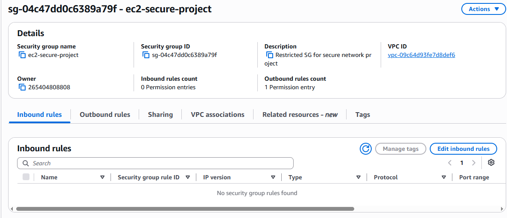
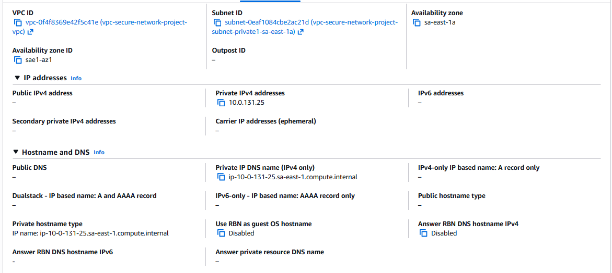
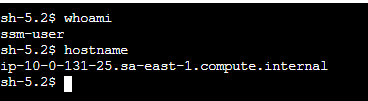
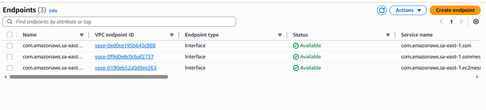

🇧🇷 [Leia em Português](README.pt-br.md)

# aws-secure-network-project

Hands-on project implementing a secure AWS network: private VPC, EC2 without public IP, and VPC Interface/Gateway endpoints enabling IAM-authenticated access via SSM Session Manager.

## Objective

Demonstrate a practical secure network architecture on AWS by combining a Security Group with no inbound rules, a VPC with no public internet access, and three VPC Endpoints (SSM, SSMMessages, and EC2Messages) to enable fully private, auditable EC2 access.

## Environment

- Amazon VPC
- Amazon EC2
- AWS Systems Manager (Session Manager)
- VPC Endpoints (Interface and Gateway)
- Security Groups

## Governance Structure

```
Root
├── VPC
│   ├── Private Route Table (no Internet Gateway route)
│   ├── Security Groups
│   │   ├── EC2 Security Group (no inbound rules)
│   │   └── Endpoint Security Group (inbound 443 from EC2 SG only)
│   ├── VPC Endpoints
│   │   ├── com.amazonaws.<region>.ssm
│   │   ├── com.amazonaws.<region>.ssmmessages
│   │   └── com.amazonaws.<region>.ec2messages
│   └── Private Subnet
│       └── EC2 Instance (no public IP, IAM Role with SSM permissions)
```

## Architecture Flow

1. EC2 instance is launched in a private subnet with no public IP and no inbound rules.
2. An IAM Role attached to the instance grants permission to communicate with AWS Systems Manager.
3. Traffic from the instance reaches SSM exclusively through the three VPC Interface Endpoints, using AWS PrivateLink instead of the public internet.
4. AWS Systems Manager Session Manager authenticates the connection via IAM and opens an encrypted, auditable shell session — with no SSH keys or open ports required.

## Key Configuration

- **VPC CIDR:** 10.0.0.0/16
- **Private Subnet CIDR:** 10.0.1.0/24
- **Route Table:** No route to an Internet Gateway (fully private)
- **EC2 Security Group:** No inbound rules; outbound HTTPS (443) allowed
- **Endpoint Security Group:** Inbound HTTPS (443) allowed only from the EC2 Security Group
- **VPC Endpoints (Interface):**
  - `com.amazonaws.<region>.ssm` — core Systems Manager API
  - `com.amazonaws.<region>.ssmmessages` — Session Manager data channel
  - `com.amazonaws.<region>.ec2messages` — agent-to-service communication
- **IAM Role:** Attached to the EC2 instance with the `AmazonSSMManagedInstanceCore` policy

## Evidence

### 1. Creating a security group with no inbound rules


### 2. Creating EC2 instance with no public IP


### 3. Connecting to the EC2 instance and testing the session


### 4. Creating the three required VPC endpoints


## Notes

- Only three Interface Endpoints are required for Session Manager to work in a fully private subnet: `ssm`, `ssmmessages`, and `ec2messages`.
- The Security Group rules must be configured bidirectionally: the EC2 instance needs outbound 443, and the Endpoint Security Group needs inbound 443 restricted to the EC2 Security Group — missing either side causes connection timeouts.
- An S3 Gateway Endpoint was also created, since the SSM Agent uses S3 internally to fetch updates. Unlike Interface Endpoints, Gateway Endpoints are free and route traffic via the route table instead of an ENI.
- This architecture eliminates the need for a bastion host, SSH keys, or open inbound ports, aligning with Zero Trust and CIS Benchmark security principles.
